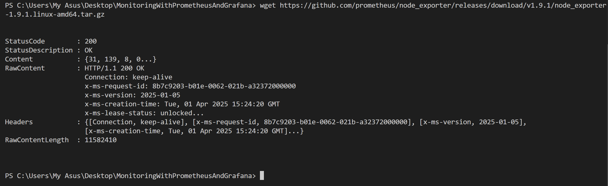
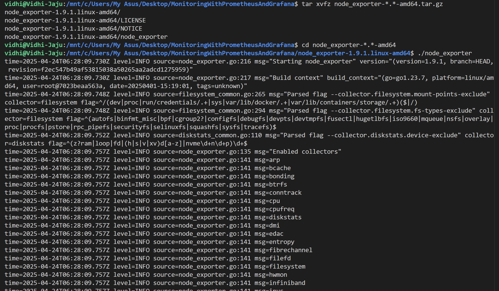
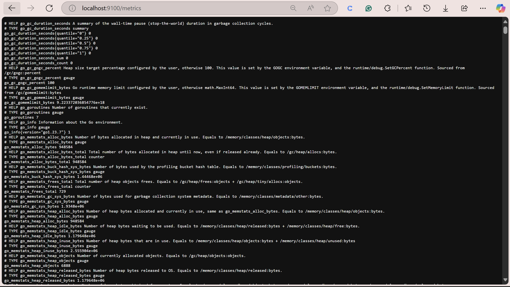
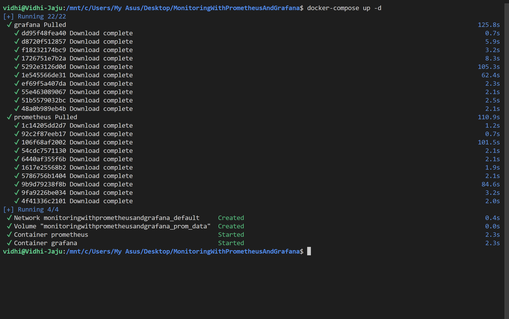
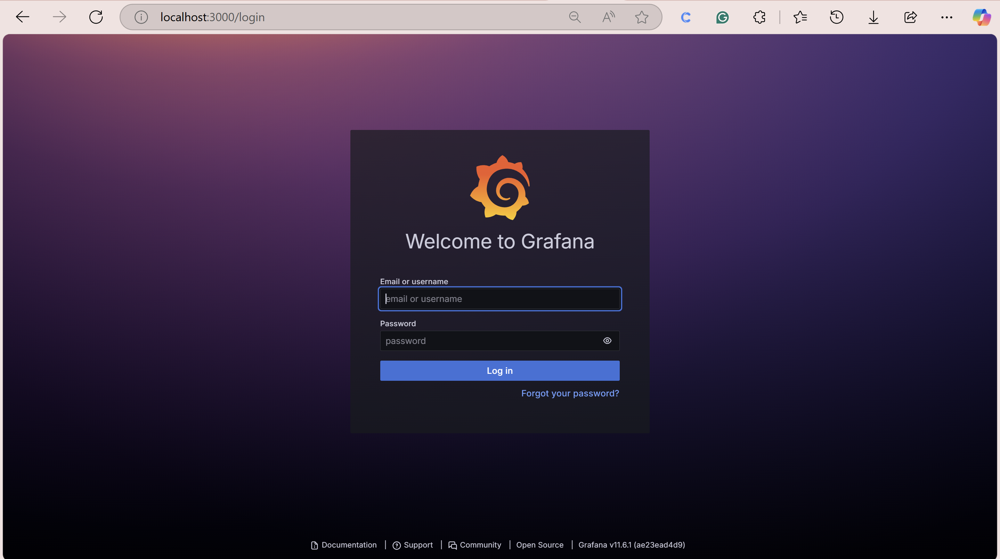
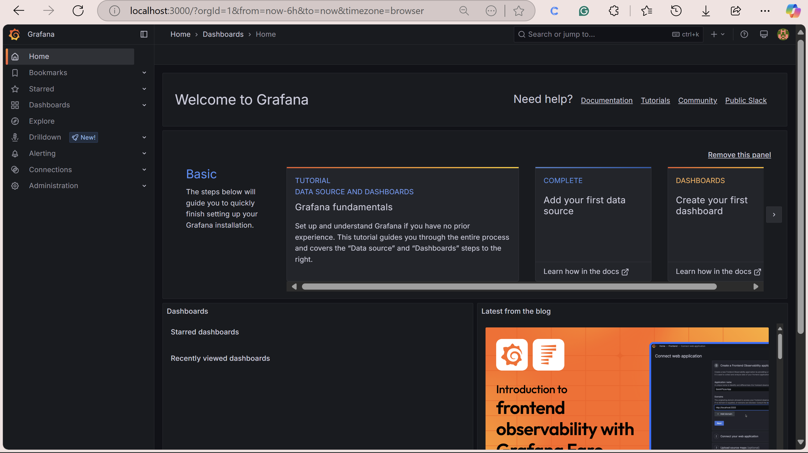
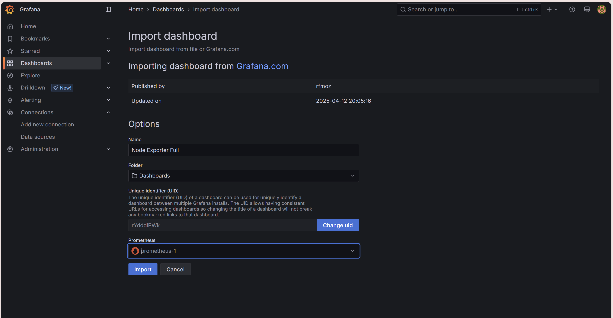
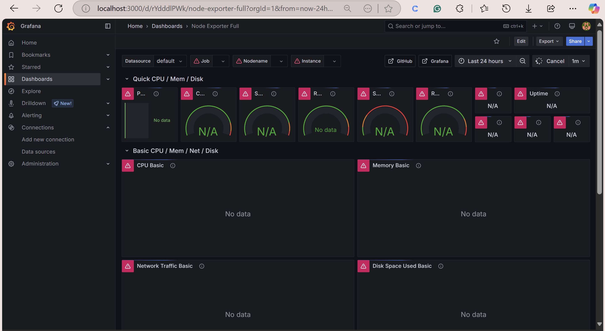

# 📊 Monitoring with Prometheus, Grafana, and Node Exporter

A complete monitoring stack using **Prometheus** for metrics collection, **Grafana** for visualization, and **Node Exporter** for exposing Linux system metrics like CPU, memory, disk, and network.

---

## 📂 Project Structure

```
MonitoringWithPrometheusAndGrafana/
├── docker-compose.yml
├── prometheus.yml
└── README.md (this file)
```

---

## 📌 Requirements

- Docker  
- Docker Compose  
- Linux/WSL/Docker container for Node Exporter

---

## 🚀 Getting Started

### 👅 Install Node Exporter (on your Linux/WSL/Docker system)

Node Exporter collects system metrics and makes them available to Prometheus.

#### 1⃣ Download and extract Node Exporter:
```bash
wget https://github.com/prometheus/node_exporter/releases/download/v1.9.1/node_exporter-1.9.1.linux-amd64.tar.gz
tar xvfz node_exporter-1.9.1.linux-amd64.tar.gz
cd node_exporter-1.9.1.linux-amd64
```




#### 2⃣ Run Node Exporter:
```bash
./node_exporter
```
This will start Node Exporter at:  
[http://localhost:9100/metrics](http://localhost:9100/metrics)

---



## 📡 Verifying Node Exporter

- Open in your browser: [http://localhost:9100/metrics](http://localhost:9100/metrics)
- Or run:
```bash
curl http://localhost:9100/metrics
curl http://localhost:9100/metrics | grep "node_"
```

**Note:**  
If Prometheus runs outside WSL/Docker, get the system IP using:
```bash
hostname -I
```
Then replace `localhost` with this IP in `prometheus.yml`.

---

## 📦 Start Prometheus & Grafana with Docker Compose

---

### 📜 `docker-compose.yml`

```yaml
version: '3'
services:
  prometheus:
    image: prom/prometheus
    ports:
      - "9090:9090"
    volumes:
      - ./prometheus.yml:/etc/prometheus/prometheus.yml

  grafana:
    image: grafana/grafana
    ports:
      - "3000:3000"
```

---

### 📜 `prometheus.yml`

```yaml
global:
  scrape_interval: 15s

scrape_configs:
  - job_name: 'node-exporter'
    static_configs:
      - targets: ['<YOUR_IP>:9100']
```
➡️ Replace `<YOUR_IP>` with your system/WSL IP address.

---

### 🟢 Start Services:
```bash
docker-compose up -d
```



---

## ✅ Verify Prometheus

Visit: [http://localhost:9090](http://localhost:9090)



Go to **Status → Targets**  
✔️ Ensure `node-exporter` is **UP**

---

## 📊 Set Up Grafana Dashboard

Visit: [http://localhost:3000](http://localhost:3000)  
**Default Login:**  
- Username: `admin`  
- Password: `admin`

---

### 🔧 Add Prometheus Data Source:

1. Go to **Configuration → Data Sources**
2. Click **Add Data Source**
3. Select **Prometheus**
4. Set URL to:
```
http://prometheus:9090
```
5. Click **Save & Test**

---

### 📊 Import Node Exporter Dashboard:

1. In Grafana, click **+ (Create)** → **Import**
2. Enter **Dashboard ID:** `1860`
3. Select Prometheus as your data source
4. Click **Import**

Or download from:  
[https://grafana.com/grafana/dashboards/1860](https://grafana.com/grafana/dashboards/1860)

---







## 🛠️ Troubleshooting

- **Node Exporter not running?**
  - Ensure it’s active with:
  ```bash
  curl http://localhost:9100/metrics
  ```

- **Prometheus not scraping?**
  - Check targets at: [http://localhost:9090/targets](http://localhost:9090/targets)
  - Restart services:
  ```bash
  docker-compose restart
  ```
  - View logs:
  ```bash
  docker-compose logs prometheus
  ```

- **Ports blocked?**
  - Disable local firewall for ports `9100`, `9090`, `3000`

---

## 📚 Resources

- [Prometheus Docs](https://prometheus.io/docs/)
- [Grafana Docs](https://grafana.com/docs/)
- [Node Exporter Guide](https://prometheus.io/docs/guides/node-exporter/)

---

## 📖 Summary

✅ **Node Exporter** exposes system metrics at `:9100/metrics`  
✅ **Prometheus** scrapes metrics from Node Exporter (`:9090`)  
✅ **Grafana** visualizes metrics via dashboards (`:3000`)  

Now you have a full **Monitoring Stack** operational on your system 🚀

---

## ✨ Author

**Vidhi Jaju**  
*Built with ❤️ for learning and monitoring.*

